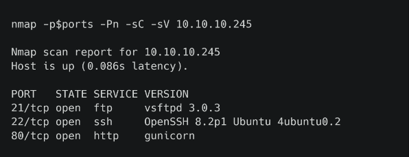
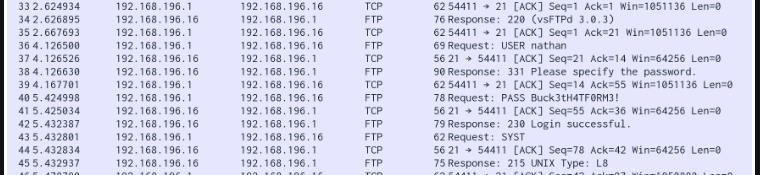
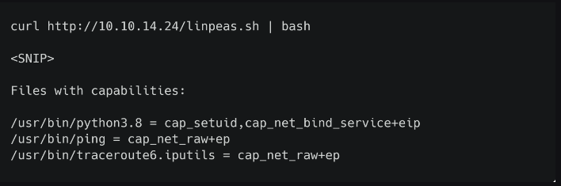

# Hack The Box - Cap

## Overview

**Cap** is an easy Linux machine focused on web application enumeration and privilege escalation.

The attack began by identifying an HTTP service that exposed administrative functionality, including system information and packet capture generation. This functionality was vulnerable to **Insecure Direct Object Reference (IDOR)**, allowing access to packet captures belonging to other users.

One of these captures contained plaintext FTP credentials. These credentials were reused to access the system via SSH, providing the initial foothold.

Privilege escalation was achieved by abusing Linux capabilities assigned to the Python binary, allowing execution of commands as root.

---

# Enumeration

## Nmap Scan

Initial Nmap scan revealed three open ports on the target:

| Port | Service |
|------|---------|
| 21 | FTP |
| 22 | SSH |
| 80 | HTTP |

### Nmap Scan Output



---

# Web Application

The web service running on port 80 provided administrative network functionality:

- IP configuration output
- Network status output
- Packet capture download feature

### HTTP Interface



---

# IDOR Vulnerability

The application used predictable, sequential numeric identifiers in its endpoint structure:
/data/<id>


By modifying the ID value to lower numbers such as:


/data/0

it was possible to access packet capture files belonging to other users on the system.

This was a classic example of an **Insecure Direct Object Reference (IDOR)** vulnerability.

### IDOR URL Manipulation



---

# Foothold

Downloading and analysing the packet capture in Wireshark revealed FTP authentication being transmitted in plaintext:

```text
USER nathan
PASS Buck3tH4TF0RM3!
The discovered credentials were tested against SSH using the same username and password due to credential reuse.

This resulted in a successful login and provided an initial shell as the user:

nathan

Privilege Escalation

Linux capability enumeration revealed that the Python binary had the following capabilities assigned:

/usr/bin/python3.8 = cap_setuid,cap_net_bind_service+eip

The cap_setuid capability allows a process to arbitrarily change its user ID.

This capability was abused to spawn a root shell:

python3 -c "import os; os.setuid(0); os.system('/bin/bash')"
LinPEAS Capability Output

Root Shell Obtained

Root Flag

With root access confirmed, the final flag was retrieved from the standard location.

/root/root.txt

Web application enumeration
Identifying IDOR vulnerabilities
Analysing packet captures with Wireshark
Credential reuse attacks
Linux capability-based privilege escalation
